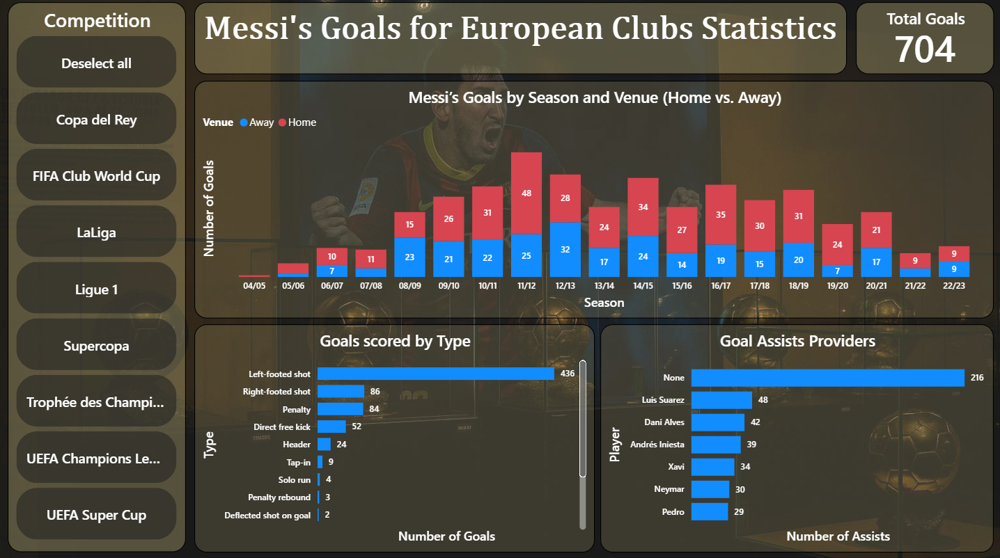
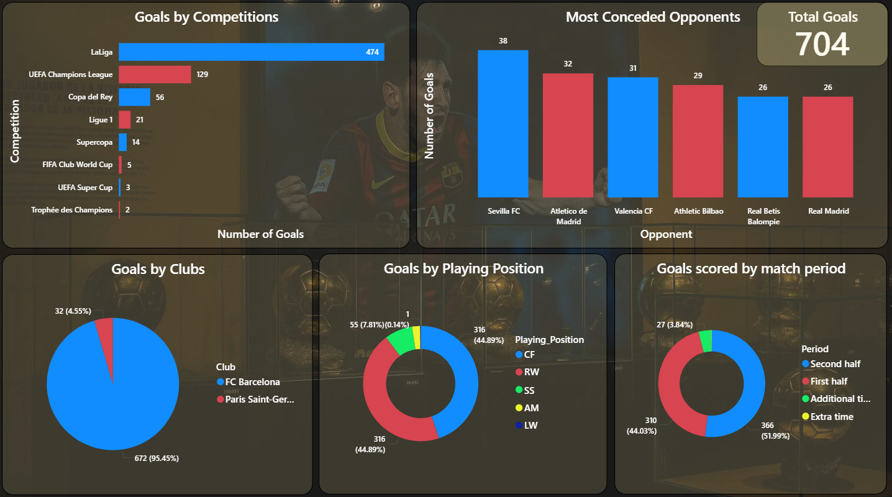
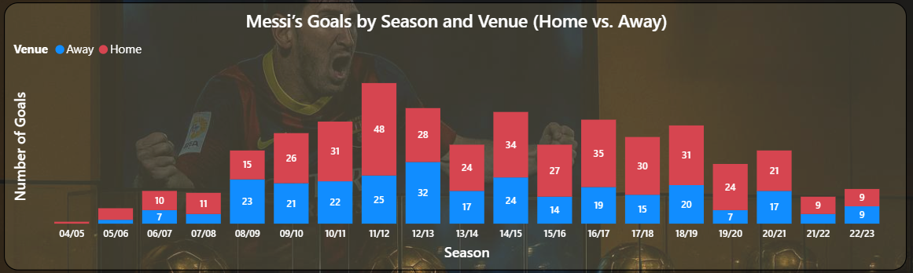

# ⚽ Data Visualization Project: Messi's Goal History

This project is a part of our **Data Visualization Group Assignment**, where we explore Lionel Messi's goal-scoring journey across European clubs using **Power BI**.

🔗 **[Watch our demo video](https://youtu.be/LiEaeDn_ZSQ)**

## Project Overview

We analyzed Messi's goals throughout his European club career using:
- **Raw match-level data** from Kaggle
- **Python preprocessing**
- **Power BI dashboards** for interactive storytelling

## Data Sources

- **Raw data**: [`raw_data.csv`](./raw_data.csv) (from Kaggle)
- **Cleaned data**: [`cleaned_data.xlsx`](./cleaned_data.xlsx)
- **Python preprocessing**: [Kaggle Notebook (Click "Edit My Copy" to run)](https://www.kaggle.com/code/hieupc/data-viz)

## Preprocessing

We used **Python (Pandas)** on Kaggle to clean, filter, and organize the raw dataset.

**Key steps:**
- Removed irrelevant columns
- Fixed inconsistent formats

> You can inspect or replicate the full preprocessing steps in the `.ipynb` notebook linked above.

## Power BI Dashboard

Here are some snapshots of our Power BI report:

### Overview Pages

### Season Comparison

## Try it Yourself

If you'd like to explore the report, open our `.pbix` file in Power BI Desktop.

